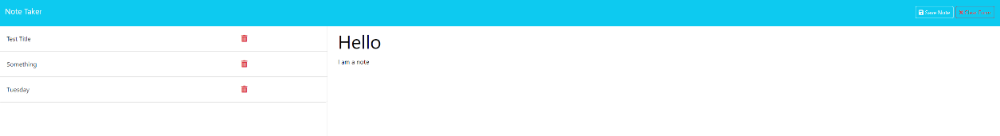

# note-taker-app

## Motivation

- The motivation behind this project is to provide small business owners with a simple and effective note-taking application. This application aims to help users organize their thoughts and keep track of tasks efficiently.

## Purpose

- The purpose of the Note-Taker application is to offer a user-friendly interface for writing, saving, and managing notes. The application provides a seamless experience for creating, viewing, and deleting notes, enhancing the user's ability to stay organized and productive.

## Problems

- Small business owners often struggle to keep their thoughts and tasks organized. Without a dedicated tool, it can be challenging to quickly jot down and save notes. This satisfies the need for a simple solution to manage tasks and notes effectively.

## Learnings

- Throughout the development of the Note-Taker application, I was able to learn valuable lessons about user experience, efficient data management, and creating an intuitive application for note-taking.

## Screenshot

## Links
[Live URL]()